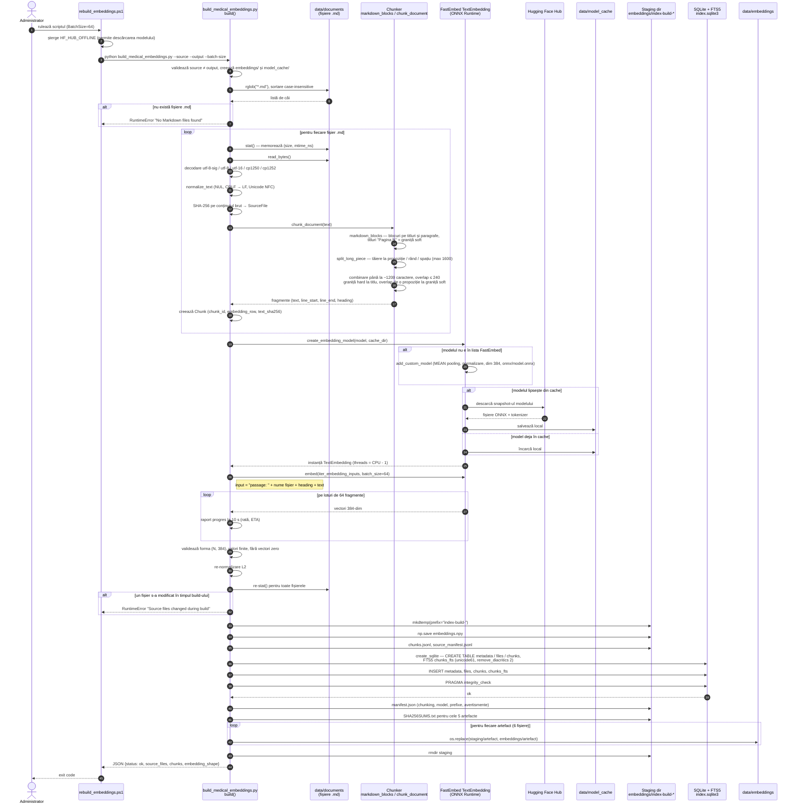
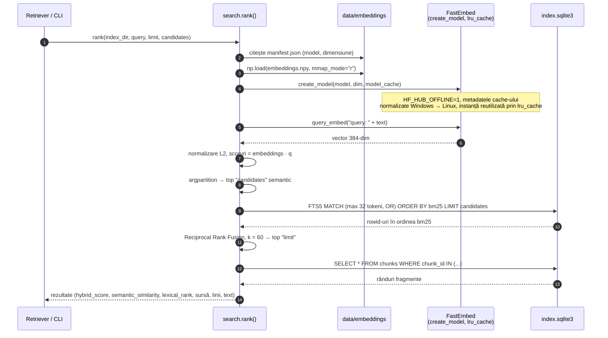

# 01 · Generarea embeddings (indexul hibrid local)

**Proiect:** medicina-naturista  
**Componente implicate:** `scripts/rebuild_embeddings.ps1`, `scripts/build_medical_embeddings.py`, `src/medicina_naturista/ai/search.py`  
**Tip diagrame:** sequence diagram (Mermaid)

## Context

Indexul este construit offline, la cerere, din fișierele Markdown din `data/documents`. Rezultatul are două componente folosite împreună la căutare:

| Componentă | Fișier | Rol |
|---|---|---|
| Semantic | `data/embeddings/embeddings.npy` | matrice `float32` N × 384, vectori normalizați L2 |
| Lexical | `data/embeddings/index.sqlite3` | tabelele `metadata`, `files`, `chunks` + FTS5 `chunks_fts` |
| Trasabilitate | `chunks.jsonl`, `source_manifest.jsonl`, `manifest.json`, `SHA256SUMS.txt` | legătura fragment → fișier-sursă → linii, sume de control |

Parametri de chunking: `TARGET_CHARS=1200`, `MAX_CHARS=1600`, `OVERLAP_CHARS=240`.  
Model: `intfloat/multilingual-e5-small` (ONNX, via FastEmbed), dimensiune 384, prefix document `passage: `, prefix interogare `query: `.

## 1.1 Construirea indexului (build complet)

## 1.2 Embedding-ul interogării la runtime (consumatorul indexului)

Același model este folosit la căutare, cu prefixul `query: `. Diagrama arată ce se întâmplă pentru **o singură** interogare în `search.rank()`; detaliile despre câte interogări se trimit per raport sunt în documentul 02.

## Observații de arhitectură

1. **Înlocuirea artefactelor nu este atomică pe ansamblu.** `os.replace` este atomic per fișier, dar cele 6 fișiere sunt mutate unul câte unul. Dacă procesul se oprește la mijloc sau aplicația web citește în acel interval, `embeddings.npy` poate aparține build-ului nou, iar `index.sqlite3` celui vechi. Cum `embedding_row` leagă cele două, rezultatul ar fi fragmente greșite fără nicio eroare. Soluție: director versionat (`embeddings/v<timestamp>/`) plus un pointer (`current.json` sau symlink) schimbat la final într-un singur pas.
2. **Dimensiunea 384 este fixă în cod**, deși `--model` este configurabil. Cu alt model build-ul cade abia după embedding, la validarea formei. Dimensiunea trebuie citită din descrierea modelului sau trecută ca parametru.
3. **Build-ul este complet de fiecare dată** și ține tot corpusul în memorie (listă de `Chunk`, apoi lista de vectori). Pentru arhiva actuală e acceptabil. La creșterea corpusului merită reconstruire incrementală pe baza `source_manifest.jsonl`: SHA-256 per fișier există deja, deci se pot re-embedda doar fișierele modificate.
4. **Protecția la modificări concurente este bună** (compararea `size` + `mtime_ns` înainte și după), la fel `integrity_check` și `SHA256SUMS.txt`. Totuși, sumele de control nu sunt verificate la pornirea aplicației. O verificare la startup ar prinde un index corupt sau amestecat, inclusiv cazul de la punctul 1.
5. **La runtime, `rank()` recitește `manifest.json` și redeschide `embeddings.npy` la fiecare interogare.** Doar modelul este în cache. Detaliile și impactul sunt în documentul 02.
