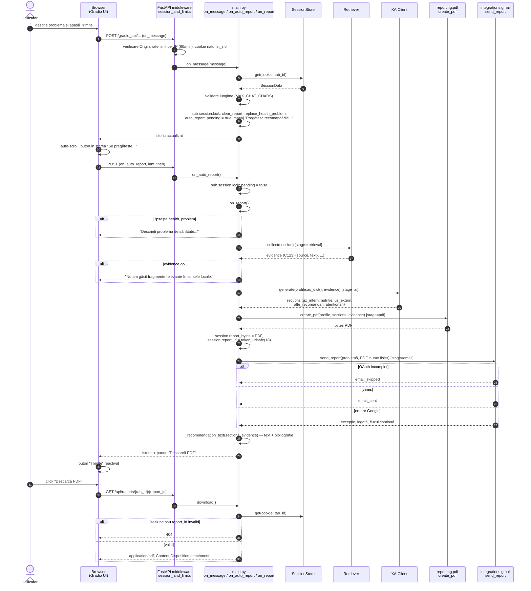
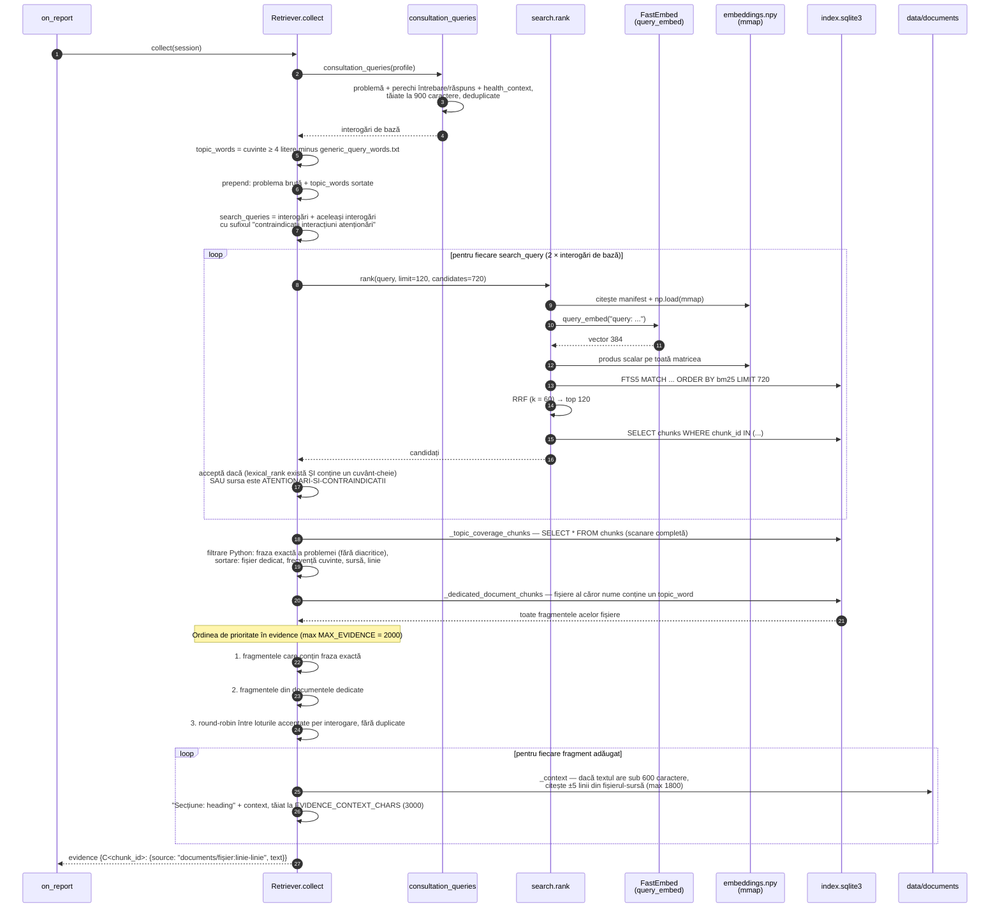
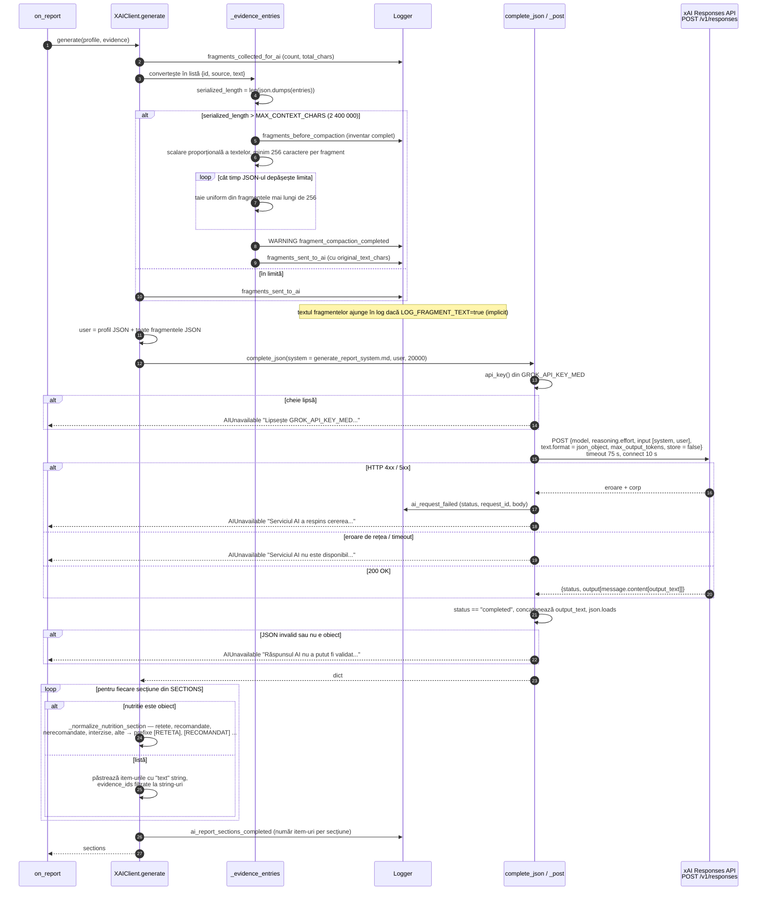
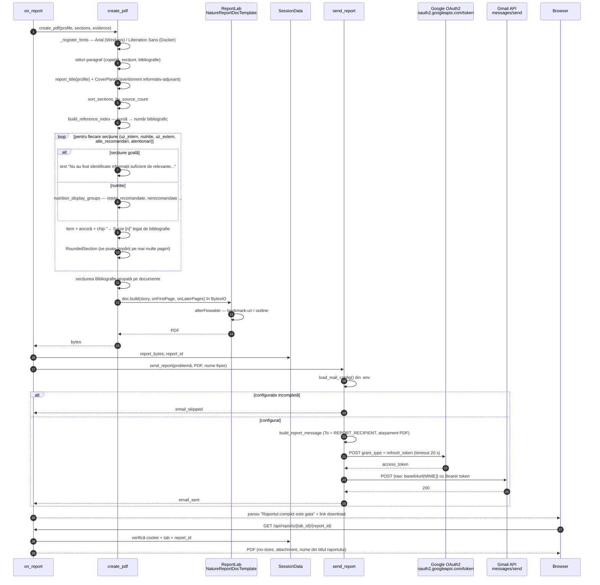

# 02 · Generarea raportului final cu recomandări naturiste

**Proiect:** medicina-naturista  
**Componente implicate:** `web/main.py`, `web/handlers.py`, `core/sessions.py`, `core/models.py`, `ai/retrieval.py`, `ai/search.py`, `ai/client.py`, `ai/prompts/generate_report_system.md`, `reporting/pdf.py`, `integrations/gmail.py`  
**Tip diagrame:** sequence diagram (Mermaid)

## Context

Fluxul pornește când utilizatorul trimite descrierea problemei de sănătate în interfața Gradio. Raportul se obține în patru etape, toate executate sincron în `on_report`, sub `session.lock`:

1. **retrieval** — căutare hibridă locală (semantic + FTS5) și asamblarea dovezilor `C<chunk_id>`;
2. **ai** — un singur request către xAI Responses API (`grok-4.3`, `reasoning.effort=low`, `json_object`, `max_output_tokens=20000`, `store=false`);
3. **pdf** — randare ReportLab în memorie (`bytes`), păstrată în sesiune;
4. **email** — trimitere best-effort prin Gmail API (OAuth2 refresh token).

Documentul are patru diagrame: orchestrarea completă (2.1), apoi detaliile pentru retrieval (2.2), requestul AI (2.3) și crearea PDF-ului cu livrarea lui (2.4).

## 2.1 Orchestrare end-to-end

## 2.2 Retrieval hibrid și asamblarea dovezilor

## 2.3 Requestul către xAI

## 2.4 Crearea PDF-ului și livrarea

## Observații de arhitectură

Punctele sunt ordonate după impact.

1. **Emailul trimite datele de sănătate ale fiecărui utilizator la o adresă fixă.** `REPORT_RECIPIENT` este hard-codat, iar utilizatorul nu primește raportul pe email și nu este informat că problema lui descrisă în subiect plus PDF-ul pleacă în altă căsuță. Pentru date medicale, asta cere cel puțin informare și consimțământ explicit (GDPR, art. 9). Tehnic, adresa trebuie mutată în configurație și operațiunea făcută opțională.
2. **`LOG_FRAGMENT_TEXT=true` este valoarea implicită.** La fiecare raport se loghează până la 2000 de fragmente întregi, la care se adaugă profilul utilizatorului în requestul AI. Logurile devin o copie a conversațiilor medicale. Valoarea implicită sigură este `false`, iar activarea să se facă explicit, doar pentru diagnostic.
3. **Trasabilitatea nu este impusă de cod.** `generate()` păstrează item-urile cu `evidence_ids` goale sau inexistente, iar PDF-ul le afișează fără sursă. Promptul cere dovezi, dar modelul nu e obligat. Recomandarea: item-urile din `uz_intern`, `uz_extern`, `alte_recomandari` și `atentionari` fără cel puțin un ID valid din `evidence` se elimină sau se marchează vizibil. Rețetele sunt singura excepție documentată în prompt.
4. **Retrieval-ul repetă I/O la fiecare interogare.** `rank()` citește `manifest.json`, redeschide `embeddings.npy` și deschide o conexiune SQLite nouă pentru fiecare dintre cele 2 × N interogări. În plus, `_topic_coverage_chunks` scanează în Python toată tabela `chunks` la fiecare raport. Soluții: un obiect `HybridIndex` încărcat o singură dată la startup (matrice în memorie, conexiune read-only reutilizată) și o interogare FTS5 pe frază (`"frază exactă"`) în locul scanării.
5. **Etapele lente rulează sincron, cu `queue=False` și sub lock.** Retrieval + un request xAI care poate dura zeci de secunde (timeout 75 s) ocupă un thread din pool pe toată durata. Nu există limitare a rapoartelor concurente, nici retry pentru 429/5xx. Pentru producție: coadă Gradio cu `concurrency_limit`, retry cu backoff exponențial pe erorile tranzitorii și un timeout total separat de cel de citire.
6. **Contextul trimis la AI poate fi foarte mare.** 2000 de fragmente × 3000 de caractere = până la 6 milioane de caractere înainte de compactare, apoi tăiate la 2,4 milioane (circa 600 000 de tokeni după estimarea din cod, `chars / 4`). Compactarea taie uniform din fiecare fragment, deci și din fragmentele de prioritate maximă (fraza exactă, documentul dedicat). Mai sigur: buget pe tokeni real și eliminarea fragmentelor de la coada priorităților în loc de trunchierea tuturor.
7. **Sesiunile și PDF-urile stau în memoria procesului.** Soluția e simplă și corectă pentru o singură instanță. Rezultatul: nu se poate scala orizontal și orice restart pierde conversațiile, lucru deja documentat în README.
